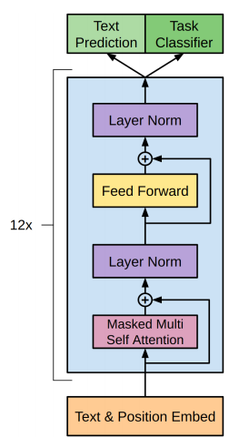

# Text classification (sentiment Analysis) fine tuning GPT2 using Tensorflow

Text classification (sentiment analysis) on tweets using GPT2 and transfer learning




 GPT2 documnetation can be found on the [Official Hugging Face page](https://huggingface.co/docs/transformers/model_doc/gpt2#openai-gpt2)

 In this exercise we are going to use TFGPT2Model: the bare GPT2 Model transformer outputting raw hidden-states without any specific head on top.

 Th idea is to get the raw hidden states from the model (exit of the blue box, before two heads, in the image) and build a classifier on top of it.

 We will use Tensorflow because it makes it easier and faster for coding.

Below is a quick example on how to use it, from the official documentation:

```python

from transformers import GPT2Tokenizer, TFGPT2Model
import tensorflow as tf

tokenizer = GPT2Tokenizer.from_pretrained("gpt2")
model = TFGPT2Model.from_pretrained("gpt2")

inputs = tokenizer("Hello, my dog is cute", return_tensors="tf")
outputs = model(inputs)

last_hidden_states = outputs.last_hidden_state

```

<br clear="left"/>


Fine tuning GPT2 on text classification with Tensorflow.
